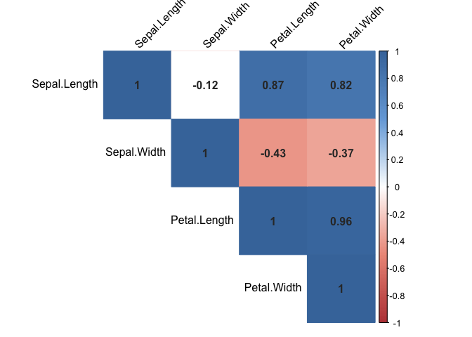
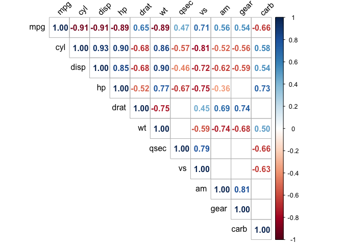

<!-- README.md is generated from README.Rmd. Please edit that file -->

# lbr

<!-- badges: start -->
<!-- badges: end -->

**My personal tools for data wrangling and analysis, a collection of
random stuff.**

**Mostly relies on `tidyverse package`.**

## Installation

You can install the development version from
[GitHub](https://github.com/Lightbridge-AI/lbr) with:

``` r
# install.packages("devtools")
devtools::install_github("Lightbridge-AI/lbr")
```

## Read multiple CSV files from a directory

I want to use `readr::read_csv()` for multiple CSV files. So, I combine
`read_csv()` with `lapply` to read from a directory path with a little
help of `fs package` to get file path and `grep()` for file pattern
matching.

``` r
  library(lbr)

# Read form current working directory by default

  read_dir_csv()
  
# And file names are set to names of each data frame in a list
  
# Give a directory path
  read_dir_csv("path/to/dir")
  
# Also, can read from sub-directory of given directory
  
  read_dir_csv("path/to/dir", recurse = T)
  
# Can specify regular expression of file names to read.
  
  read_dir_csv(regexp = "[[:digit:]]+")  # CSV file name contains numbers
  
# If set strict_csv_ext = F and remove regex which require file name ending with .csv
# it might read other file type as well (if you like)
  
  read_dir_csv(regexp = "[[:digit:]]+\\.txt$", strict_csv_ext = FALSE) # Try read .txt file
  
# If you want file names in snake_case (require snakecase package)
  
  read_dir_csv(snake_case = TRUE)
```

## Read multiple files by supply a function

**Now, you can supply any file reading function you want to read from a
directory !**

`read.dir()` can read multiple files from a directory using a function
supplied by a user.

-   First argument `fun` is any function you want to use as reading
    engine. (first argument of `fun` must be file path) eg.
    `utils::read.csv`

-   Second argument `path` is a path to directory.

-   Third argument `pattern` is a regular expression to match file name
    and extension you want to read.

-   `...` : argument pass to `fun` .

``` r
# Read .csv file form working directory (default) using `utils::read.csv`. 

  read.dir(utils::read.csv) # default `pattern` is "\\.csv$"
  
# Read .xlsx file from a directory using `readxl::read_excel`. 
## Must specify regular expression to match file extension.
  
  read.dir(readxl::read_excel, path = "path/to/dir" ,pattern = "\\.xlsx$")
  
# Read .rds file ; To also read form sub-directory set `recursive = TRUE` .
  
  read.dir(readRDS, pattern = "\\.rds$", path = "path/to/dir" ,recursive = TRUE)
  
# Read files using multiple engine from multiple path and multiple file extension.
  
  params <- list(fun = c(readr::read_csv, readxl::read_excel),
                 path = c("path/to/dir_1", "path/to/dir_2"),
                 pattern = c("\\.csv$", "\\.xlsx$")
                 )
  
  purrr::pmap(params, read.dir)
  
  # or using base R
  
  ls <- vector("list", 2)
  for(i in seq_along(params[[1]])){
    ls[[i]]  <- read.dir(fun = params[[1]][[i]],  path = params[[2]][[i]],
                         pattern = params[[3]][[i]])
  }
```

## Plot correlation from data frame

**A wrapper around `corrplot::corrplot()` which accept data frame as
input.**

-   Can set p-value to exclude non-significant correlation out from the
    plot.

-   Correlation calculation method: “pearson”, “spearman” or “kendall”
    can be specified in `method_cor` argument.

-   `...` pass to arguments of **`corrplot::corrplot()`**

``` r
library(lbr)

# Plot correlation of numeric column (automatically filter only numeric for plot)

corrplot_df(iris)
```



``` r
mtcars %>% 
  corrplot_df(method_plot = "circle", # specify graphic method of correlation
                method_cor = "pearson", # method of calculation of correlation
                type = "lower",         # display lower half of correlation plot
                sig.level = 0.01,       # p-value = 0.01
                insig = "pch"           # insignificant will be crossed out 
                )
```


``` r
mtcars %>% 
  corrplot_df(method_plot = "number",   # Show correlation as number
                method_cor = "spearman",# Calculate correlation by "spearman" method
                type = "upper",         # display upper half of correlation plot
                sig.level = 0.05,       # p-value = 0.05
                insig = "blank"         # insignificant will be blank (default)
                )
```


